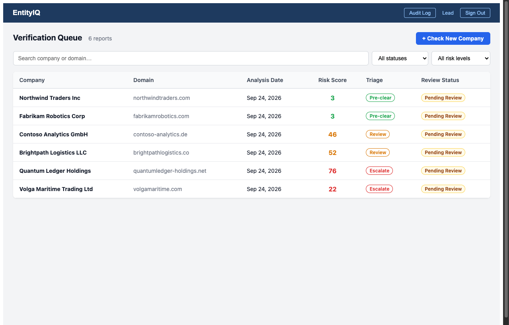
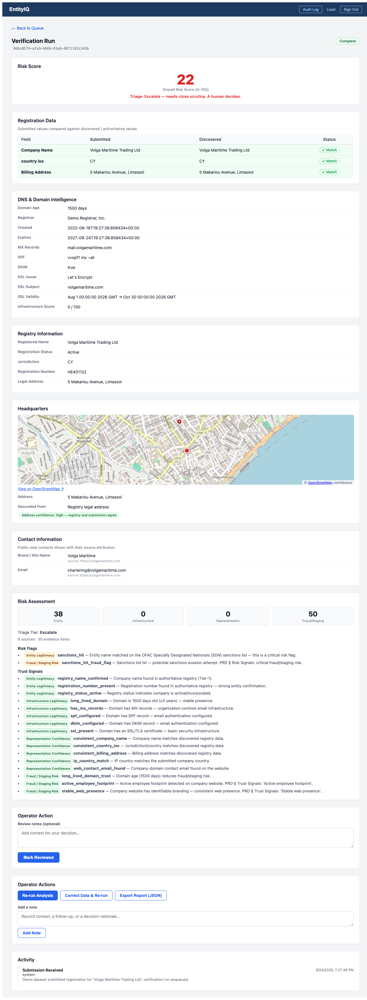
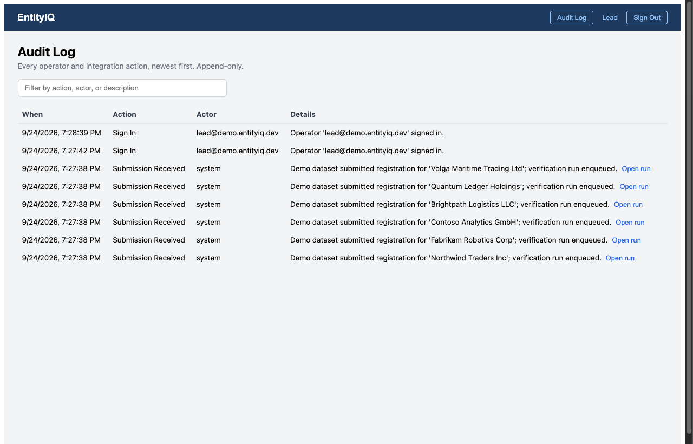
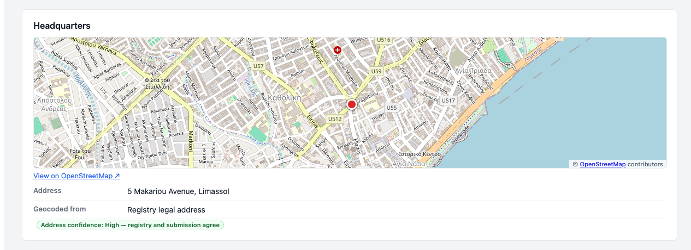

# EntityIQ

**Business verification and individual sanctions screening, with explainable
decisions a compliance team can defend.**

EntityIQ has two offerings on one platform. They share the same operator
workbench, auth, audit log and database.

- **EntityIQ Business Verification.** When a company registers itself for an
  enterprise account, someone has to decide whether it's real, whether it's
  who it says it is, and whether it's safe to approve. EntityIQ gathers
  evidence from:
  - business registries;
  - sanctions lists;
  - domain and email infrastructure;
  - network data;
  - the company's own website.

  It checks what was submitted against what it found and produces a
  **deterministic, explainable risk score** that sorts the review queue.
- **EntityIQ Individual Screening.** It answers one question: *is the person
  in front of us the same person as this sanctions-list record?* It screens
  people against the official OFAC, UN, EU and UK lists. It scores every
  candidate match with named, weighted terms, each of which cites its source.
  Every decision is recorded with frozen inputs, so it can be **replayed to
  the same verdict** after the lists have changed.

Neither offering approves anyone. A human makes every decision, and every
action is audited.



## Quick start

```bash
./scripts/demo.sh
```

Needs Python 3.11+ and Node 20+. No Docker, Postgres, or Redis. On first run
the script sets everything up and loads the demo data:

- six fictional companies that span every risk tier;
- four fictional people that span every screening outcome (MATCH, REVIEW and
  auto-CLEAR).

It then serves:

- **UI:** http://localhost:5173. The password for every demo account is
  `entityiq-demo`. Sign in as:
  - `lead@demo.entityiq.dev`;
  - `operator@demo.entityiq.dev`;
  - `examiner@demo.entityiq.dev` (read-only).

  **Businesses** and **Individuals** are separate sections in the nav.
- **API docs:** http://localhost:8000/docs

The demo runs through the real pipelines with recorded source responses and a
fictional watchlist, so it's deterministic and works offline. Details are in
[docs/RUNBOOK.md](docs/RUNBOOK.md).

## What it does

### Business verification

| | |
|---|---|
| **Four-layer scoring** | Four layers are each scored 0–100 and combined into an overall score: entity legitimacy, infrastructure legitimacy, representation confidence, and fraud/staging risk. |
| **Triage, not verdicts** | Every run lands in `pre_clear`, `review`, or `escalate`. Critical signals (such as a sanctions match) force `escalate` whatever the score. Nothing is ever auto-approved. |
| **Explainable** | Every signal cites the evidence rows behind it, with source attribution. An unavailable source *lowers confidence*; it's never counted as "low risk". |
| **Identity corroboration** | Checks the tax ID (FEIN) and LinkedIn company page against the submission. Both run on stub providers until live vendors are chosen (see known gaps). |
| **Domain-ownership proof** | An optional challenge (DNS TXT, email or meta tag) the registrant can complete to raise confidence that they control the domain. |
| **Operator workbench** | Everything for reviewing one case: the submitted-vs-discovered diff, domain/DNS, registry, contacts, and an HQ map with address confidence. Operators can also flag risks, review with notes, correct and re-run, export JSON, and see a per-case activity timeline. |
| **Integration API** | Endpoints: `POST /submissions` (API key or operator token, idempotent), report read and export, and re-analysis. Leads provision API keys in the UI. The client IP is captured at the trusted edge, so a client can't spoof it via `X-Forwarded-For`. |

<p>
  
  
</p>



### Individual screening

| | |
|---|---|
| **Official lists, versioned** | Parses OFAC SDN, UN, EU and UK OFSI into person records with names, aliases, DOBs, nationalities, places of birth and ID documents. Each ingest is a snapshot identified by its content hash. |
| **Recall-first matching** | Candidates are found despite transliteration, reversed name order, particles and patronymics (al, bin, van, von), accents, nicknames and initials. A record that matches the whole name is never dropped, even for very common names. |
| **Named, cited scoring** | Terms include `name_exact_normalized`, `dob_full_match`, `id_number_match` and `dob_conflict`. Each has a declared weight and cites its evidence. Conflicts appear as their own terms and are never averaged away. |
| **CLEAR / REVIEW / MATCH** | REVIEW is the "not sure" band. A run auto-closes as CLEAR only when every candidate is below the clear threshold and every required list is present and fresh. A missing list is never counted as "no risk". |
| **Replayable decisions** | Each decision freezes its inputs, list snapshots, rule version, terms and thresholds. `POST /screenings/{id}/replay` recomputes the verdict with no list or network access. |
| **"Why this decision?" panel** | A pull-out sidebar walks through every decision a run made: lists checked, candidates found, how each scored and why it got its band, the final disposition, and human review. Each piece of evidence is a citation naming the list, entry, field and list date. It expands to the snapshot hash and the published list file. Backed by `GET /screenings/{id}/explanation`. |
| **Ongoing monitoring** | A new list snapshot re-screens affected subjects as new runs. Past decisions are never edited. |
| **Privacy by design** | Each subject's data is encrypted with its own key. Once the 5-year AML retention period ends, the key is destroyed (crypto-shredding), which leaves the append-only records intact but unreadable. |
| **Examiner role** | A read-only role for regulators. It can view every screening and the audit log and replay decisions, but can't write. |

## How it works

**Business verification:**

```
POST /submissions ──► FastAPI ──► Submission + VerificationRun (pending)
                                          │  Celery (Redis, or inline in dev)
                                          ▼
  normalize → resolve → registries → tax ID → sanctions → domain → IP → web
            → LinkedIn → consistency → geocode HQ → scoring → report
                                          │
      Operator UI (React) ◄── GET /reports ┘      every stage isolated:
                                                   a failed source is marked
                                                   "unavailable", the run continues
```

**Individual screening:**

```
POST /screenings ──► FastAPI ──► encrypted subject + ScreeningRun
                                          │  dedicated "screening" Celery queue,
                                          ▼  run budget in seconds
     block candidates → score terms → dispose (CLEAR / REVIEW / MATCH)
                                          │
                                          ▼
     append-only decision: frozen inputs · snapshots · rule version · terms
                                          │
     Individuals UI ◄── GET /screenings/{id} (+ /explanation, /replay)
```

- **Sources:**
  - OpenCorporates (registry);
  - OFAC SDN, UN, EU and UK OFSI (sanctions);
  - WHOIS/DNS/SSL (domain, MX, SPF, DKIM);
  - IPinfo (geo, ASN, VPN/hosting);
  - the company website (branding, contacts);
  - OpenStreetMap Nominatim (HQ geocoding).

  Every client is injectable, so the whole test suite runs offline.
- **Scoring** (`backend/app/scoring/` for businesses, `backend/app/screening/`
  for individuals) is plain, rule-based code. Every weight and threshold is
  explicit. No ML, no LLM, no black box. Screening weights and thresholds are
  versioned data (rule versions), so a change never rewrites a past decision.
- **Append-only audit.** The audit log and screening decisions reject UPDATE
  and DELETE at the database layer (triggers on Postgres and SQLite), not
  just in code.
- **Stack:**
  - FastAPI, SQLAlchemy/Alembic and Celery;
  - Postgres (SQLite in dev and tests);
  - Redis-backed operator sessions, with an in-memory fallback;
  - React 18 + TypeScript + Vite.

## Quality

- **951 backend tests** and **89 frontend tests**, plus ruff, eslint and tsc,
  all run in [GitHub Actions](.github/workflows/ci.yml).
- **Screening release gates in CI**, measured over a versioned, fictional
  adversarial name corpus:
  - blocking recall must stay at 100%;
  - decision reproducibility must stay at 100%.

  CI also publishes the false-positive rate at full recall and the REVIEW
  rate as a report.
- A golden fixture pins the screening engine's output for every corpus case,
  so a refactor can't silently change a verdict.
- An end-to-end test drives the real business-verification stage list with
  only network clients faked. It exists because unit tests alone once missed
  that the adapters and the scoring disagreed on field names.
- The demo dataset's expected triage tiers and screening outcomes are pinned
  by tests.

## Deployment

A private (IAM-only) demo instance on Google Cloud Run with Cloud SQL
Postgres. It's one image serving the UI and the API; migrations and the seed
run as Cloud Run Jobs; secrets come from Secret Manager. The decision is
[ADR-0005](docs/decisions/0005-cloud-run-hosting.md). Steps are in
[docs/runbooks/deploy-cloud-run.md](docs/runbooks/deploy-cloud-run.md). The
first deploy is paused partway through; the runbook has the resume command.

## Status and known gaps

The business-verification core is complete. Individual screening v1
(deterministic, official sanctions lists) is complete. What's still open:

- **Registry data needs a key and a license.** OpenCorporates requires an API
  token (`OPENCORPORATES_API_TOKEN`); without one, the registry source shows as
  *unavailable*. Production use also needs a data license.
- **Tax ID and LinkedIn run on stub providers.** The live vendors are waiting
  on a provider decision and a legal sign-off. See
  [docs/PRD-identity-corroboration.md](docs/PRD-identity-corroboration.md).
- **Screening covers official sanctions lists only.** PEP lists, adverse
  media and a calibrated name-judgment model are deferred until the data is
  licensed and a model provider is chosen.
- **Screening gaps against the requirements** are mapped in
  [the spec-gap plan](docs/plans/2026-09-25-001-individual-screening-spec-gaps-plan.md).
  The main ones:
  - per-jurisdiction thresholds;
  - a lead-facing way to change rules;
  - day-to-day metrics such as alerts per 1,000 screenings and
    time-to-disposition;
  - a regression suite of confirmed failures;
  - a known recall gap: first names spelled with "th" vs "t" (Theodor vs
    Teodor) don't match.
- **Screening thresholds aren't tuned on labeled data yet.** Under the
  default rule, a name plus a full date of birth lands in REVIEW, not MATCH.

The business-verification audit, including a live-data run, is in
[docs/ASSESSMENT-2026-09-24.md](docs/ASSESSMENT-2026-09-24.md).

## Documentation

- [docs/problem-statement.md](docs/problem-statement.md): the problem
- [docs/PRD.md](docs/PRD.md): business-verification requirements
- [docs/identity-verification-PRD.md](docs/identity-verification-PRD.md): individual-screening requirements
- [docs/PRD-identity-corroboration.md](docs/PRD-identity-corroboration.md): tax-ID and LinkedIn corroboration
- [docs/STRATEGY.md](docs/STRATEGY.md): approach, metrics, tracks
- [docs/USERS.md](docs/USERS.md): operators, leads, integrating systems, registrants
- [docs/ARCHITECTURE.md](docs/ARCHITECTURE.md): technical design and decisions
- [docs/BUILD_PLAN.md](docs/BUILD_PLAN.md) and [docs/BUILD_PLAN-individual-screening.md](docs/BUILD_PLAN-individual-screening.md): build plans and status
- [docs/plans/](docs/plans/): feature plans, including the decision evidence panel
- [docs/decisions/](docs/decisions/): ADRs (PII retention, screening libraries, crypto-shred retention, Cloud Run hosting)
- [docs/RUNBOOK.md](docs/RUNBOOK.md) and [docs/runbooks/](docs/runbooks/): setup, list ingestion and monitoring, full-stack mode, deployment
- [docs/implementation-notes.md](docs/implementation-notes.md): dated decision log
