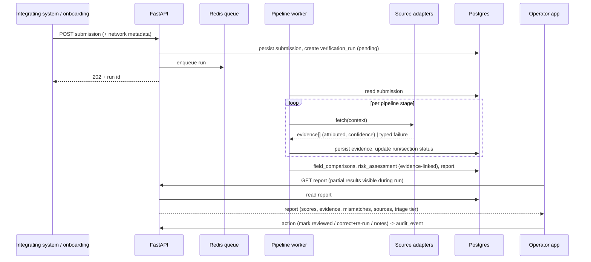
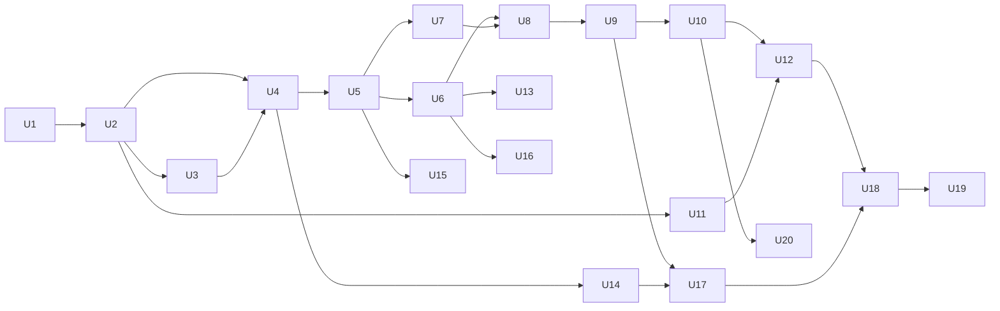

# feat: EntityIQ Enterprise Verification & Risk Intelligence Platform

## Summary

Build the EntityIQ platform greenfield: an ingestion API that captures enterprise
registration data and requester network metadata, an authoritative-first agentic
verification pipeline, a layered and explainable 0–100 risk assessment that triages
the operator queue, an audited operator workbench, and an integration/reporting API.
Delivered MVP-first (a thin end-to-end slice) then deepened track by track. The
system augments a human verdict and never auto-approves.

---

## Problem Frame

A B2B platform's self-service enterprise registration lets anyone claim to be a company,
exposing impersonation, fake-company, and sanctions-evasion risk. Manual review is
both unreliable (evidence is fragmented across inconsistent global registries with
no single source of truth) and unscalable (capped by operator time, quality varies
by reviewer). EntityIQ exists to make the operator's verdict fast, consistent, and
defensible without removing the human. See origin docs in *Sources & References*.

---

## Requirements

- R1. Ingest registrations via API (required + optional fields) and capture requester network metadata server-side. *(PRD § API § Submission, § Inputs, § Network & IP)*
- R2. Run an async, authoritative-first agentic verification pipeline (normalize → resolve → registries → domain/infra → IP → public web → consistency → score → store) with viewable partial results and re-analysis that supersedes prior runs. *(PRD § Agentic Verification Pipeline; ARCHITECTURE § 2)*
- R3. Produce an explainable four-layer 0–100 risk assessment (entity, infrastructure, representation, fraud/staging) with triage tiers, where every signal traces to an attributed evidence record. *(PRD § Risk Scoring, § Explainability; STRATEGY § Our approach, § Key metrics)*
- R4. Compute submitted-vs-discovered field comparisons with match/mismatch indicators. *(PRD § FE § Registration Data)*
- R5. Provide an authenticated, fully audited operator workbench: queue with filters, detail view (registration diff, DNS/domain, registry, contacts, HQ map, risk panel), and operator actions (mark reviewed, re-run, correct + re-run, notes, export). *(PRD § Frontend Requirements; USERS § 1)*
- R6. Expose an integration & reporting API: report retrieval, re-analysis trigger, operator-workflow endpoints, and machine-readable report extraction, authenticated for integrating systems. *(PRD § Backend § REST API, § API Requirements; USERS § 2)*
- R7. Record an immutable audit trail: operator actions, verification runs, risk-score changes, evidence sources used, and re-analysis history. *(PRD § Auditability Requirements)*
- R8. Enrich the requester IP (geo, ASN/ISP, org, hosting/VPN/proxy, distance/mismatch, reuse) and emit network risk flags. *(PRD § Network & IP Intelligence)*
- R9. Support optional domain-ownership verification (email, DNS TXT, HTML meta) that raises confidence without asserting authorization. *(PRD § Domain Ownership Verification)*
- R10. Meet performance posture: accuracy over speed, < 2h per company, partial results viewable during processing. *(PRD § Performance Expectations)*
- R11. Ship a clean monorepo (`frontend/ backend/ shared/ docs/ tests/`) with BE + FE test coverage. *(PRD § Code Quality Expectations, § Technical Success)*
- R12. Never auto-approve and never replace human compliance review — a human signs every approval. *(PRD § Non-Goals; STRATEGY § Our approach)*
- R13. Treat submissions, contacts, and network metadata as PII: role-gated, audited access under a retention policy. *(ARCHITECTURE § 6)*

**Origin actors:** Verification operator (primary), Integrating systems (co-primary), Compliance lead (secondary), Enterprise registrant (subject, not an operator). *(USERS)*

---

## Scope Boundaries

- No auto-approval or automated compliance decisioning — output is advisory; a human decides. *(R12)*
- No definitive legal authorization verification; domain ownership raises confidence only.
- No guarantee of fraud prevention — this is a risk-reduction/confidence platform.
- No "scrape everything first" behavior; scraping is fallback enrichment behind structured sources.

### Deferred to Follow-Up Work

- **Co-primary user tiebreaker** (operator-UX vs API-consumer conflicts): unresolved in STRATEGY; resolve when a concrete conflict surfaces.
- **Specific Tier-1 provider contracts/licensing** (OpenCorporates plan tier, government registries, sanctions APIs, LinkedIn): gated on procurement/legal; plan builds against a pluggable adapter interface so providers can be swapped without rework.

---

## Context & Research

### Relevant Code and Patterns

- Greenfield repo (docs + `.claude/` only). No implementation code exists yet — these units establish the patterns rather than follow them.
- Authoritative design is `docs/ARCHITECTURE.md` (components, pipeline, data model, adapters, auth). Implementation units cite its sections in lieu of existing code.

### Institutional Learnings

- None on file (`docs/solutions/` absent). First-time patterns should be captured via `ce-compound` after implementation.

### External References

- Skipped at plan time: greenfield repo with thorough internal design docs. Recommend version-specific FastAPI/Celery/SQLAlchemy and IPinfo/WHOIS library research at the start of Phase 0 (U1) once the stack is confirmed.

---

## Key Technical Decisions

- **Backend: Python + FastAPI (provisional)**: matches the verification/enrichment/parsing-heavy domain; ARCHITECTURE Open Decision #1 recommendation. Confirm before U1; flipping to Node/TS reshapes file layout but not unit boundaries.
- **Async orchestration: Celery + Redis**: simple, mature fit for the per-run pipeline (Open Decision #2).
- **Storage: Postgres**, schema migrations via Alembic.
- **Frontend: React + TypeScript**, minimal UI framework.
- **`shared/` = generated API contract**: backend emits OpenAPI; FE consumes generated TS types rather than hand-written duplicates.
- **Adapter pattern for every external source**: uniform `fetch(context) -> [evidence]`, typed failures, caching, rate-limiting, graceful degradation. Isolates the pipeline from provider churn and the unresolved data-source decision (#5).
- **Evidence-centric model for explainability**: scores reference the `evidence` rows that produced them; no signal contributes without an attributed source (R3).
- **Trusted edge IP is authoritative** for network intelligence — raw `X-Forwarded-For` is spoofable (ARCHITECTURE § 5).
- **Append-only audit log** as the system of record for R7.

---

## Open Questions

### Resolved During Planning

- Backend stack: Python + FastAPI (provisional, confirm in U1).
- Orchestration: Celery + Redis.
- Data sources: modeled as pluggable adapters; OpenCorporates is the first concrete Tier-1 source.

### Deferred to Implementation

- Operator SSO/IdP specifics — MVP uses a minimal session auth; OIDC/SSO is the target once the IdP is known.
- HQ map provider (Mapbox / Google / Leaflet+OSM) — Open Decision #4; resolved when U18 is reached.
- Exact scoring weights and triage-tier thresholds — require real evidence distributions to tune.
- PII retention duration and access matrix — Open Decision #7; resolved when U23 is reached.
- Which Tier-1 providers are actually obtainable — Open Decision #5; affects U6/U17 source coverage.

---

## Output Structure

    backend/
      app/
        main.py                 # FastAPI app entrypoint
        api/                    # routers: submissions, reports, reanalysis, workflow, auth
        schemas/                # Pydantic request/response models
        models/                 # ORM: submission, entity, verification_run, evidence,
                                #      field_comparison, risk_assessment, report,
                                #      operator, review, audit_event
        db/                     # session + Alembic migrations
        pipeline/               # orchestrator + stages (normalize, resolve, consistency)
        adapters/               # base + opencorporates, domain, ipinfo, web, sanctions
        scoring/                # layered scoring, triage tiers, explainability assembly
        auth/                   # operator + service-credential auth, RBAC
        audit/                  # audit-event recording
      tests/
      pyproject.toml
    frontend/
      src/
        pages/                  # dashboard (queue), company detail
        components/             # registration diff, risk panel, dns panel, registry,
                                #      contacts, hq map
        api/                    # generated client + hooks
        auth/
      tests/
      package.json
    shared/
      openapi.json              # generated contract (source of truth for FE types)
      types/                    # generated TS types
    tests/                      # cross-cutting / e2e
    .gitlab-ci.yml

---

## High-Level Technical Design

> *This illustrates the intended approach and is directional guidance for review, not implementation specification. The implementing agent should treat it as context, not code to reproduce.*

Pipeline ordering follows ARCHITECTURE § 2 (authoritative-first; IP enrichment as a
distinct stage; scraping last). Each stage writes evidence independently so a slow or
failed source degrades to an `unavailable` section rather than failing the run.

---

## Phased Delivery

- **Phase 0 — Foundations (U1–U3):** monorepo, data model, async orchestration skeleton.
- **Phase 1 — MVP vertical slice (U4–U12):** thinnest end-to-end path; a submission becomes a stored, reviewable report.
- **Phase 2 — Deepen the tracks (U13–U20):** full evidence breadth, full scoring/explainability, full workbench, full integration API.
- **Phase 3 — Hardening (U21–U25):** performance, audit completeness, PII policy, optional domain-ownership, coverage + docs.

---

## Implementation Units

### U1. Monorepo scaffold + tooling

**Goal:** Stand up the `frontend/ backend/ shared/ docs/ tests/` monorepo with the confirmed stack, linting/formatting, test runners, and CI.

**Requirements:** R11

**Dependencies:** None (confirm Open Decision #1 stack first)

**Files:**
- Create: `backend/app/main.py`, `backend/pyproject.toml`
- Create: `frontend/package.json`, `frontend/src/main.tsx`
- Create: `shared/.gitkeep`, `tests/.gitkeep`
- Create: `.gitlab-ci.yml`

**Approach:**
- FastAPI app with a `/health` route; React+TS app shell.
- Configure ruff + pytest (backend), eslint + vitest (frontend); CI runs lint + tests for both packages.

**Patterns to follow:** Greenfield — establish the monorepo convention from PRD § Suggested Architecture § Monorepo and ARCHITECTURE § 1.

**Test scenarios:**
- Happy path: backend `/health` returns 200 with status payload.
- Happy path: frontend app shell renders and the test runner executes a smoke test.
- Integration: CI pipeline runs backend + frontend lint and tests on push and fails on a deliberate lint error.

**Verification:** `make`/CI runs both packages' lint + tests green; `/health` reachable locally.

---

### U2. Core data model + migrations

**Goal:** Define and migrate the core schema: `submission`, `entity`, `verification_run`, `evidence`, `field_comparison`, `risk_assessment`, `report`, `operator`, `review`, `audit_event`.

**Requirements:** R2, R3, R4, R7

**Dependencies:** U1

**Files:**
- Create: `backend/app/models/*.py`, `backend/app/db/session.py`, `backend/app/db/migrations/`
- Test: `backend/tests/test_models.py`

**Approach:**
- Evidence-centric: `risk_assessment` and `field_comparison` reference `evidence` rows; `verification_run` carries status + `supersedes`; `audit_event` is append-only.
- Follow ARCHITECTURE § 3 field sketches.

**Patterns to follow:** ARCHITECTURE § 3 (data model), § 6 (append-only audit).

**Test scenarios:**
- Happy path: migrations apply cleanly to an empty DB and round-trip each model.
- Edge case: a `verification_run` can reference the run it supersedes; null on first run.
- Integration: inserting an `audit_event` is append-only (no update/delete path exposed by the model layer).

**Verification:** Migration up/down works; models persist and relate as designed.

---

### U3. Async orchestration skeleton

**Goal:** Celery + Redis worker that drives a `verification_run` through ordered stages, recording per-stage/section status, exposing partial results, and superseding prior runs on re-analysis.

**Requirements:** R2, R10

**Dependencies:** U2

**Files:**
- Create: `backend/app/pipeline/orchestrator.py`, `backend/app/pipeline/base.py`, `backend/app/worker.py`
- Test: `backend/tests/pipeline/test_orchestrator.py`

**Approach:**
- Stage registry executed in order; each stage isolated so a failure marks its section `unavailable` without aborting the run. Re-analysis creates a new run and links `supersedes`.

**Execution note:** Start with a failing integration test asserting partial-result visibility and stage isolation.

**Patterns to follow:** ARCHITECTURE § 2 (execution properties).

**Test scenarios:**
- Happy path: a run with two stub stages transitions pending → running → complete and persists results.
- Edge case: a stage raising is recorded as `unavailable`; the run still completes other stages.
- Integration: report is readable mid-run with per-section status; re-analysis produces a new run that supersedes the prior one.

**Verification:** A queued run executes stages asynchronously; partial results and supersession observable in the DB.

---

### U4. Submission endpoint + network-metadata capture

**Goal:** `POST` submission accepting required + optional inputs, capturing requester network metadata server-side, persisting the `submission`, and enqueuing a run.

**Requirements:** R1, R8 (capture only)

**Dependencies:** U2, U3

**Files:**
- Create: `backend/app/api/submissions.py`, `backend/app/schemas/submission.py`
- Test: `backend/tests/api/test_submissions.py`

**Approach:**
- Validate required fields (company name, work email, domain, country); accept optionals (tax ID, billing address, phone, requester metadata, LinkedIn).
- Capture source IP (trusted edge, not raw `X-Forwarded-For`), user agent, timestamp, forwarded headers, endpoint. Idempotency on a client key.

**Patterns to follow:** PRD § API § Submission, § Network & IP; ARCHITECTURE § 5 (trusted edge IP).

**Test scenarios:**
- Happy path: valid submission persists and enqueues a run; returns 202 + run id.
- Edge case: free/disposable work-email domain is flagged (not rejected) for downstream scoring.
- Error path: missing required field → 422 with field detail.
- Edge case: spoofed `X-Forwarded-For` is ignored in favor of the edge-assigned IP.
- Integration: duplicate submission with same idempotency key does not create a second run.

**Verification:** Submitting creates a `submission` + `verification_run` with network metadata recorded.

---

### U5. Pipeline stage — normalize input

**Goal:** Canonicalize domain, country, email, and address; stub country-aware tax-ID formatting.

**Requirements:** R2

**Dependencies:** U4

**Files:**
- Create: `backend/app/pipeline/normalize.py`
- Test: `backend/tests/pipeline/test_normalize.py`

**Approach:** Deterministic normalization producing a canonical entity context the later stages consume.

**Patterns to follow:** ARCHITECTURE § 2 stage 1.

**Test scenarios:**
- Happy path: mixed-case domain/email normalized; country mapped to ISO code.
- Edge case: malformed domain or unsupported country handled without raising.

**Verification:** Normalized context persisted and available to subsequent stages.

---

### U6. Source adapter interface + first Tier-1 adapter (OpenCorporates)

**Goal:** Define the uniform adapter contract and implement the first authoritative-source adapter returning attributed evidence with confidence.

**Requirements:** R2, R3

**Dependencies:** U5

**Files:**
- Create: `backend/app/adapters/base.py`, `backend/app/adapters/opencorporates.py`
- Test: `backend/tests/adapters/test_base.py`, `backend/tests/adapters/test_opencorporates.py`

**Approach:**
- `fetch(context) -> [evidence]` with typed failures (timeout/unavailable/not-found/rate-limited). Adapter emits registry evidence (existence, status, jurisdiction, identifiers, legal address) with source attribution.

**Patterns to follow:** ARCHITECTURE § 4 (adapter contract); PRD § Tier 1.

**Test scenarios:**
- Happy path (mocked provider): a known company returns registry evidence with attribution + confidence.
- Error path: provider timeout → typed `unavailable` failure; no exception escapes.
- Edge case: no match → `not-found` with zero evidence, not an error.

**Verification:** Pipeline run yields persisted Tier-1 evidence for a known fixture; failures degrade gracefully.

---

### U7. Tier-2 domain/infrastructure signals adapter

**Goal:** Collect WHOIS/domain age, DNS, MX, SPF/DKIM, SSL metadata, and registrar info as evidence.

**Requirements:** R2, R3

**Dependencies:** U5

**Files:**
- Create: `backend/app/adapters/domain.py`
- Test: `backend/tests/adapters/test_domain.py`

**Approach:** Wrap WHOIS/DNS/SSL lookups; emit infrastructure evidence and recency/anomaly signals.

**Patterns to follow:** ARCHITECTURE § 4; PRD § Tier 2; § FE § DNS & Domain Intelligence.

**Test scenarios:**
- Happy path: long-lived domain with MX/SPF/valid SSL produces trust-leaning evidence.
- Edge case: recently registered domain with no MX produces elevated-risk signals.
- Error path: WHOIS unavailable → `unavailable` section, run continues.

**Verification:** Domain evidence + signals persisted for fixture domains.

---

### U8. Consistency checks → field comparisons

**Goal:** Compute submitted-vs-discovered `field_comparison` (match / mismatch / unverified) across core fields.

**Requirements:** R3, R4

**Dependencies:** U6, U7

**Files:**
- Create: `backend/app/pipeline/consistency.py`
- Test: `backend/tests/pipeline/test_consistency.py`

**Approach:** Compare submitted values against discovered evidence; record per-field status with the evidence that supports it.

**Patterns to follow:** ARCHITECTURE § 2 stage 7; PRD § FE § Registration Data.

**Test scenarios:**
- Happy path: matching legal name/address → `match`.
- Edge case: registry country ≠ submitted country → `mismatch`.
- Edge case: no discovered value → `unverified` (not mismatch).

**Verification:** Field comparisons persisted and linked to supporting evidence.

---

### U9. Risk scoring v1 + report assembly

**Goal:** Produce an overall 0–100 score and the available layer scores from current signals, each linked to evidence, and assemble a queryable `report`.

**Requirements:** R3, R12

**Dependencies:** U8

**Files:**
- Create: `backend/app/scoring/engine.py`, `backend/app/scoring/report.py`
- Test: `backend/tests/scoring/test_engine.py`

**Approach:**
- Deterministic v1 scoring over available evidence/signals; record contributing signals referencing `evidence`. No approve/reject decision — advisory only (R12).

**Patterns to follow:** PRD § Risk Scoring, § Explainability.

**Test scenarios:**
- Happy path: strong registry + long-lived domain → low risk; explanation lists contributing evidence.
- Edge case: registry mismatch + fresh domain → elevated risk with named signals.
- Edge case: missing sources reduce confidence rather than defaulting to low risk.
- Integration: every score component references at least one evidence row (no orphan signals).

**Verification:** Report contains overall + layer scores with evidence-linked explanations.

---

### U10. Report retrieval API

**Goal:** `GET` endpoints returning the normalized report (evidence, scores, mismatches, sources), partial-result aware.

**Requirements:** R6, R10

**Dependencies:** U9

**Files:**
- Create: `backend/app/api/reports.py`, `backend/app/schemas/report.py`
- Test: `backend/tests/api/test_reports.py`

**Approach:** Serialize the report with per-section status so consumers can read mid-run results.

**Patterns to follow:** PRD § API § Report Endpoint; § Backend § REST API.

**Test scenarios:**
- Happy path: completed run returns full report with scores/evidence/mismatches/sources.
- Edge case: in-progress run returns partial report with `pending` sections.
- Error path: unknown report id → 404.

**Verification:** Report retrievable via API in both partial and complete states.

---

### U11. Operator auth + audit foundation

**Goal:** Operator sign-in (minimal session for MVP), RBAC (operator/lead), and append-only `audit_event` recording on operator actions.

**Requirements:** R5, R7, R13

**Dependencies:** U2

**Files:**
- Create: `backend/app/auth/operator.py`, `backend/app/audit/recorder.py`, `frontend/src/auth/`
- Test: `backend/tests/auth/test_operator.py`, `backend/tests/audit/test_recorder.py`

**Approach:** Session auth abstracted behind an interface so OIDC/SSO can replace it later; every operator action funnels through the audit recorder.

**Execution note:** Auth boundary is security-sensitive — test unauthorized access paths explicitly.

**Patterns to follow:** PRD § FE § Operator Authentication, § Auditability; ARCHITECTURE § 5; USERS § Access.

**Test scenarios:**
- Happy path: valid operator logs in and receives a scoped session.
- Error path: unauthenticated request to a protected route → 401.
- Error path: operator attempts a lead-only action → 403.
- Integration: a mark-reviewed action writes an attributable `audit_event`.

**Verification:** Auth gates protected routes; actions produce audit events.

---

### U12. Operator app — list + detail + mark reviewed (MVP slice close)

**Goal:** Dashboard list (company, analysis date, risk score, review status) and a detail view showing submitted-vs-discovered with match/mismatch indicators and a mark-reviewed action.

**Requirements:** R4, R5

**Dependencies:** U10, U11

**Files:**
- Create: `frontend/src/pages/dashboard.tsx`, `frontend/src/pages/company-detail.tsx`, `frontend/src/components/registration-diff.tsx`
- Test: `frontend/tests/dashboard.test.tsx`, `frontend/tests/company-detail.test.tsx`

**Approach:** Consume the report API via generated client; render the diff with clear match/mismatch visuals; mark-reviewed posts an audited action.

**Patterns to follow:** PRD § FE § Dashboard, § Company Detail § Registration Data; USERS § 1.

**Test scenarios:**
- Happy path: list renders analyzed companies with score + review status.
- Happy path: detail view shows submitted vs discovered with visible mismatch markers.
- Integration: marking reviewed updates status and triggers the audited action.
- Edge case: a still-running report shows partial sections without breaking the view.

**Verification:** An operator can sign in, open a report, see the diff, and mark it reviewed — MVP vertical slice complete.

---

### U13. Entity candidate resolution

**Goal:** Resolve the normalized submission to candidate real-world entities before authoritative lookups.

**Requirements:** R2

**Dependencies:** U6

**Files:**
- Create: `backend/app/pipeline/resolve.py`
- Test: `backend/tests/pipeline/test_resolve.py`

**Approach:** Generate ranked candidate identities to disambiguate registry lookups; handle multiple conflicting identities as a risk signal.

**Patterns to follow:** ARCHITECTURE § 2 stage 2.

**Test scenarios:**
- Happy path: clear name+domain resolves to a single high-confidence candidate.
- Edge case: multiple conflicting candidates flagged for the risk model.

**Verification:** Candidate set persisted and consumed by downstream registry stage.

---

### U14. Network/IP intelligence enrichment

**Goal:** Enrich the captured submission IP (geo, ASN/ISP, org, hosting/VPN/proxy, distance/mismatch, reuse patterns) and emit network risk flags.

**Requirements:** R3, R8

**Dependencies:** U4

**Files:**
- Create: `backend/app/adapters/ipinfo.py`
- Test: `backend/tests/adapters/test_ipinfo.py`

**Approach:** IPinfo (or equivalent) behind the adapter interface; compute distance/mismatch vs claimed company/billing location and reuse across submissions.

**Patterns to follow:** PRD § Network & IP Intelligence; ARCHITECTURE § 2 stage 5, § 4.

**Test scenarios:**
- Happy path: residential IP in the claimed country → no network flag.
- Edge case: datacenter/VPN IP → anonymized-network flag.
- Edge case: IP country ≠ company/billing country → mismatch flag.
- Edge case: repeated submissions from the same IP/ASN → reuse flag.
- Error path: provider unavailable → `unavailable` section, run continues.

**Verification:** IP enrichment + flags persisted and surfaced in the report.

---

### U15. Public web evidence (Tier-3, Playwright fallback)

**Goal:** Collect public web evidence (site, contacts, directories, press footprint) and extract contact people as fallback enrichment.

**Requirements:** R3

**Dependencies:** U5

**Files:**
- Create: `backend/app/adapters/web.py`
- Test: `backend/tests/adapters/test_web.py`

**Approach:** Structured fetch first, Playwright fallback only when needed; extract names/phones/emails/addresses with attribution. Respect robots/ToS and rate limits.

**Patterns to follow:** PRD § Tier 3; § FE § Contact Information; ARCHITECTURE § 4 (scraping as fallback).

**Test scenarios:**
- Happy path: company site yields branding + contact evidence with source attribution.
- Edge case: thin/templated site → low employee-footprint signal.
- Error path: site unreachable → `unavailable`, no run failure.

**Verification:** Web evidence + extracted contacts persisted with attribution.

---

### U16. Adapter robustness (caching, rate-limiting, degradation)

**Goal:** Add caching, per-source rate-limiting, typed-failure handling, and run-level source-availability summary across all adapters.

**Requirements:** R2, R10

**Dependencies:** U6

**Files:**
- Create: `backend/app/adapters/cache.py`, `backend/app/adapters/ratelimit.py`
- Modify: `backend/app/adapters/*.py`
- Test: `backend/tests/adapters/test_cache.py`, `backend/tests/adapters/test_ratelimit.py`

**Approach:** Cache keyed by `(source, lookup_key)` with per-source TTL; back off on rate limits; record availability per run so scoring can account for coverage.

**Patterns to follow:** ARCHITECTURE § 4.

**Test scenarios:**
- Happy path: repeated lookup within TTL is served from cache (no second provider call).
- Edge case: rate-limited provider triggers backoff, not failure.
- Integration: run records which sources were available; scoring confidence reflects it.

**Verification:** Re-analysis is cheaper; degraded sources are visible in the run summary.

---

### U17. Full four-layer scoring + triage + explainability

**Goal:** Implement the full entity/infrastructure/representation/fraud-staging layers with weighting, the elevated-risk and trust signal catalog, triage tiering (pre-clear vs escalate), and the explainability surface.

**Requirements:** R3, R12

**Dependencies:** U9, U14

**Files:**
- Modify: `backend/app/scoring/engine.py`
- Create: `backend/app/scoring/signals.py`, `backend/app/scoring/triage.py`, `backend/app/scoring/explain.py`
- Test: `backend/tests/scoring/test_signals.py`, `backend/tests/scoring/test_triage.py`

**Approach:**
- Map the PRD signal catalog to layer contributions; produce a triage tier feeding the operator queue. Triage never auto-approves — it orders work (R12).

**Patterns to follow:** PRD § Core Verification Philosophy, § Risk Signals, § Risk Scoring; STRATEGY § Our approach (triage), § Key metrics (triage precision/recall).

**Test scenarios:**
- Happy path: clean entity → low risk, `pre-clear` tier with full explanation.
- Edge case: sanctions/registry mismatch → high risk, `escalate` tier.
- Edge case: thin web + datacenter IP + fresh domain stack into elevated fraud/staging layer.
- Integration: each layer score lists contributing signals, each tracing to evidence.
- Edge case: a `pre-clear` tier still requires a human action to approve (no auto-decision).

**Verification:** Reports show four-layer scores, a triage tier, and complete signal→evidence attribution.

---

### U18. Operator workbench completeness

**Goal:** Complete the detail view (DNS/domain panel, registry info, contacts with attribution, risk panel with flags + operator notes, HQ map) and add dashboard filters/search.

**Requirements:** R5

**Dependencies:** U12, U17 (map provider = Open Decision #4)

**Files:**
- Create: `frontend/src/components/{dns-panel,registry-panel,contacts-panel,risk-panel,hq-map}.tsx`
- Modify: `frontend/src/pages/{dashboard,company-detail}.tsx`
- Test: `frontend/tests/company-detail-panels.test.tsx`

**Approach:** One panel per evidence domain; HQ map with address-confidence indicator; queue filters by risk/status/date.

**Patterns to follow:** PRD § Company Detail View (all subsections), § Dashboard (filters/search); USERS § 1.

**Test scenarios:**
- Happy path: each panel renders its evidence with source attribution.
- Happy path: HQ map renders with an address-confidence indicator.
- Edge case: missing/unavailable section renders an explicit empty state, not a crash.
- Happy path: dashboard filters narrow the queue by risk tier and review status.

**Verification:** Operator sees the full evidence picture and can filter the queue.

---

### U19. Operator actions — correct + re-run, re-trigger, notes, export

**Goal:** Implement correct-submitted-data + re-analyze, re-trigger analysis, add review notes, and export report — all audited.

**Requirements:** R5, R7

**Dependencies:** U18, U20

**Files:**
- Create: `frontend/src/components/correction-form.tsx`, `backend/app/api/workflow.py` (corrections hook)
- Modify: `backend/app/audit/recorder.py`
- Test: `backend/tests/api/test_workflow_actions.py`, `frontend/tests/operator-actions.test.tsx`

**Approach:** Corrections create a new run superseding the prior; export produces a portable report; every action writes an audit event.

**Patterns to follow:** PRD § Operator Actions; § Auditability.

**Test scenarios:**
- Happy path: correcting a field and re-running supersedes the prior run and records the change.
- Happy path: re-trigger analysis enqueues a fresh run.
- Happy path: export returns a complete report artifact.
- Integration: each action emits an attributable audit event including risk-score changes.

**Verification:** All operator actions function and are audited; corrections drive re-analysis.

---

### U20. Integration & reporting API

**Goal:** Re-analysis endpoint, operator-workflow endpoints, machine-readable report extraction, and service-credential auth for integrating systems.

**Requirements:** R6, R7, R13

**Dependencies:** U10

**Files:**
- Create: `backend/app/api/reanalysis.py`, `backend/app/auth/service.py`
- Modify: `backend/app/api/workflow.py`
- Test: `backend/tests/api/test_reanalysis.py`, `backend/tests/auth/test_service.py`

**Approach:** Service credentials authenticate integrating systems with per-system attribution; re-analysis and workflow endpoints mirror operator capabilities for machines.

**Execution note:** API auth boundary is security-sensitive — test unauthorized and cross-system access explicitly.

**Patterns to follow:** PRD § Backend § REST API, § API Requirements; ARCHITECTURE § 5; USERS § 2.

**Test scenarios:**
- Happy path: authenticated system triggers re-analysis and pulls the resulting report.
- Error path: missing/invalid service credential → 401.
- Integration: re-analysis via API supersedes the prior run and is attributable to the caller.

**Verification:** Integrating systems can submit/re-analyze/retrieve programmatically with attribution.

---

### U21. Performance & partial-result hardening

**Goal:** Ensure the < 2h target with timeouts/retries per external call and a responsive partial-result UX.

**Requirements:** R10

**Dependencies:** Phase 2 complete

**Files:**
- Modify: `backend/app/pipeline/orchestrator.py`, `backend/app/adapters/*.py`
- Test: `backend/tests/pipeline/test_timeouts.py`

**Approach:** Per-call timeouts + bounded retries; surface progress so operators see results as they land.

**Patterns to follow:** PRD § Performance Expectations.

**Test scenarios:**
- Edge case: a slow source times out within budget; run completes within target.
- Integration: partial results stream to the UI as stages complete.

**Verification:** Runs complete within target even with a slow/failing source; progress visible.

---

### U22. Auditability completeness + lead views

**Goal:** Ensure the full audit set (actions, runs, score changes, sources used, re-analysis history) is recorded and provide lead-facing audit/consistency views.

**Requirements:** R7

**Dependencies:** U11

**Files:**
- Create: `frontend/src/pages/audit.tsx`, `backend/app/api/audit.py`
- Test: `backend/tests/api/test_audit.py`

**Approach:** Read-only audit views for leads; consistency sampling support (operator vs operator / vs system tier).

**Patterns to follow:** PRD § Auditability; USERS § 3.

**Test scenarios:**
- Happy path: audit view lists actions/runs/score changes with actor + timestamp.
- Edge case: score-change history reconstructs prior runs.
- Error path: operator (non-lead) cannot access lead audit views → 403.

**Verification:** Complete, attributable audit history is queryable by leads.

---

### U23. PII retention & access policy

**Goal:** Enforce role-gated access and a retention policy over submissions, contacts, and network metadata.

**Requirements:** R13

**Dependencies:** U2 (Open Decision #7 — retention duration)

**Files:**
- Create: `backend/app/db/retention.py`, `backend/app/auth/pii.py`
- Test: `backend/tests/test_retention.py`

**Approach:** Retention job purges/anonymizes per policy; PII access is role-gated and audited.

**Patterns to follow:** ARCHITECTURE § 6 (PII handling).

**Test scenarios:**
- Happy path: records past retention are purged/anonymized.
- Error path: unauthorized PII access denied and audited.
- Edge case: audit history retained even as PII is anonymized.

**Verification:** Retention enforced; PII access gated and logged.

---

### U24. Optional domain-ownership verification

**Goal:** Support email, DNS TXT, and HTML meta-tag verification that raises confidence without asserting authorization.

**Requirements:** R9

**Dependencies:** U4

**Files:**
- Create: `backend/app/api/ownership.py`, `backend/app/pipeline/ownership.py`
- Test: `backend/tests/api/test_ownership.py`

**Approach:** Issue a challenge token; verify via the chosen method; record an ownership trust signal that explicitly does not imply authorization.

**Patterns to follow:** PRD § Domain Ownership Verification; USERS § 4.

**Test scenarios:**
- Happy path: correct DNS TXT token verifies and adds a trust signal.
- Edge case: token absent/incorrect → unverified, no trust signal.
- Edge case: verified ownership does not raise representation-confidence to "authorized".

**Verification:** Ownership challenges verify correctly and contribute a bounded confidence signal.

---

### U25. Test coverage + documentation

**Goal:** Close BE + FE coverage gaps (incl. cross-layer e2e) and document setup, API, and operator workflows.

**Requirements:** R11

**Dependencies:** Phase 2 complete

**Files:**
- Create: `tests/e2e/test_submission_to_review.py`
- Create/Modify: `docs/` (API + operator runbook), `README.md`
- Test: coverage config in `backend/pyproject.toml`, `frontend/package.json`

**Approach:** One end-to-end test covering submit → pipeline → report → operator review; document the contract and workflows.

**Test scenarios:**
- Integration (e2e): a submitted registration becomes a reviewable, scored report an operator can act on.
- Test expectation: docs changes are non-behavioral — no unit tests beyond the e2e above.

**Verification:** Coverage thresholds met; e2e green; docs current.

---

## System-Wide Impact

- **Interaction graph:** API → queue → pipeline workers → adapters → DB → API/FE. Operator actions and API calls both funnel through the audit recorder.
- **Error propagation:** External-source failures are typed and contained per stage (`unavailable` sections), never aborting a run; auth failures surface as 401/403; validation as 422.
- **State lifecycle risks:** Re-analysis supersession must not orphan or double-count evidence; partial reports must render safely; idempotency guards duplicate submissions.
- **API surface parity:** Operator actions (re-run, corrections, notes) and their API equivalents (U19/U20) must stay behaviorally consistent for the two co-primary users.
- **Integration coverage:** Submit→pipeline→report→review e2e (U25) proves what unit mocks cannot.
- **Unchanged invariants:** No auto-approval path exists anywhere; triage tiers order work but never decide (R12).

---

## Risk Analysis & Mitigation

| Risk | Likelihood | Impact | Mitigation |
|------|-----------|--------|------------|
| Backend stack (Open Decision #1) flips after planning | Med | Med | Plan provisional on Python/FastAPI; confirm before U1; unit boundaries are stack-agnostic |
| Tier-1 data sources unobtainable / licensing blocked (#5) | Med | High | Adapter interface keeps sources pluggable; MVP uses one accessible source; coverage degrades gracefully |
| Scraping brittleness (Tier-3) | High | Med | Structured-first, Playwright fallback only; typed failures; `unavailable` sections |
| Confidently-wrong scoring drives bad triage | Med | High | Evidence-linked explanations; escaped-fraud metric; human signs every approval (R12) |
| Spoofed network metadata | Med | Med | Trust edge IP, not raw forwarded headers (U4) |
| PII exposure / retention non-compliance (#7) | Low | High | Role-gated access, audited, retention job (U23) |
| Performance miss on slow sources | Med | Med | Per-call timeouts/retries, partial results (U21) |

---

## Success Metrics

- **Triage precision & recall** — pre-cleared cases confirmed low-risk; truly-risky cases flagged elevated. *(STRATEGY § Key metrics)*
- **Inter-operator decision consistency** — agreement on the same case.
- **Escaped-fraud / false-approval rate** — approved accounts later found bad (the real-world guard).
- *(Watch-item from STRATEGY: no headline throughput metric yet — revisit if the scale half can't be shown.)*

---

## Alternative Approaches Considered

- **Node/TypeScript backend** (single language with FE + `shared/`): rejected as default because the verification/enrichment/parsing domain has stronger Python tooling; remains a viable flip (Open Decision #1).
- **Synchronous verification on submit**: rejected — multi-source lookups exceed request budgets and the PRD requires partial results within a < 2h window; async orchestration is required.
- **Monolithic scoring function**: rejected in favor of evidence-linked layered scoring so explainability (R3) is structural, not bolted on.

---

## Sources & References

- **Origin documents:** [docs/PRD.md](../PRD.md), [docs/STRATEGY.md](../STRATEGY.md), [docs/ARCHITECTURE.md](../ARCHITECTURE.md), [docs/USERS.md](../USERS.md), [docs/problem-statement.md](../problem-statement.md)
- Open Decisions tracked in [docs/ARCHITECTURE.md](../ARCHITECTURE.md#open-decisions) (#1 stack, #2 orchestration, #4 map, #5 sources, #7 PII).
